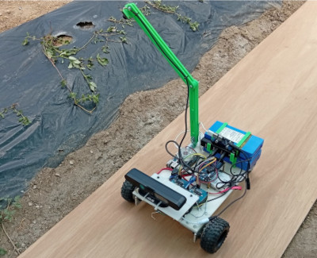

# Deep Learning for Dual Network Architecture for Furrow Following and Weed Detection

## INTRODUCTION
As the worldwide population continues to grow, the agricultural workforce is aging, and newer generations are increasingly moving away from farming toward urban employment. This trend creates a pressing need to further automate agricultural processes. In other words, intelligent agriculture must continue to be developed to ensure that fields can maintain or increase productivity with reduced labor. According to FAO et al. [[1]](https://www.fao.org/faostat/en/#home), the global harvested area of major primary crops reached 1.5 billion hectares in 2024, representing an increase of 197 million hectares compared to 2010.

In this context, unmanned ground vehicles (UGVs) represent a means to achieve autonomy in the field with minimal human intervention. These systems can be equipped with sensors such as LiDAR, RGB cameras, GPS, and onboard computers to perform different agricultural tasks, including soil seeding, crop and weed detection, and pesticide application, enabling precision agriculture.

This repository presents the feasibility of training two independent convolutional networks within a decoupled computational framework using synchronized RGB images acquired by a differential-drive robot in a greenhouse. A lightweight convolutional neural network with fully connected layers (CNN-FC) predicts steering-angle and velocity control commands, while a U-Net segments plant regions on a plastic mulch using binary pseudo-labels automatically generated via HSV color-space thresholding.

## SYSTEM DESCRIPTION
The robotic system used for gathering the data is ilustrated in Figure 1. The robot is equipped with an ASUS Xtion Pro RGB-D camera for visual perception of the furrow, an Arducam 5 MP wide angle USB camera for weed image acquisition, an Orange Pi 5 single-board computer with 16 GB RAM,  two Pololu DC geared motors driven by an IBT-2 motor driver based on the BTS7960 high-current H-bridge chip and an Arduino Mega 2560 microcontroller to control the speed and direction  through PWM signals generated.


<p align="center">
  
  <br>
  <em><b>Figure 1.</b> The experimental platform.</em>
</p>


## PREREQUISITES TO TRAIN THE ARCHITECTURE
 
### Hardware Specifications 
 * **CPU:** Intel Core i7-14700KF
 * **RAM:** 32GB 
 * **GPU:** 2x NVIDIA GeForce RTX (12 GB and 16 GB VRAM)
 * **OS:**  Ubuntu 22.04.1 LTS
 
### Software Environment
* **Framework:** PyTorch 2.12.0+cu132
* **Interface:** Jupyter Notebook 7.5.6


## PREREQUISITES TO RUN THE LAUNCH FILES

### Hardware Specifications 
 * **CPU:** Rockchip RK3588S
 * **RAM:** 15.6GB 
 * **GPU:** llvmpipe (LLVM 14.0.0, 128 bits) / Mali-G610 (Panfrost)
 * **OS:**  Ubuntu 22.04.1 LTS
 
### Software Environment
* **Framework:** ROS2


## Repository Structure & Packages


```text
.
├── assets/
│   └── robot.jpg                                  # Picture of the robot setup
├── README.md                                      # Main project documentation
└── src/                                           # Custom ROS 2 Workspace Packages
    ├── andromina_ai_driver/
    │   └── src/
    │       └── andromina_ai_furrow.cpp            # Main control node for AI trajectory 
    │
    ├── andromina_ai_model/
    │   ├── andromina_ai_model/
    │   │   └── andromina_ai_onnx_model_server.py  # Python inference script
    │   └── models/                                # Deep learning weights directory
    │       ├── best_control_model.onnx            # Optimized inference weights
    │       ├── best_control_model.pt              # PyTorch backbone checkpoints
    │       └── best_unet.pt                       # Segmentation network weights
    │
    ├── andromina_control_bringup/
    │   └── launch/                                # System Deployment Launch Layer
    │       ├── andromina_ai.launch.py             # Run full AI model tracking network
    │       ├── andromina_system.launch.py         # Bring up hardware (cameras, sensors)
    │       └── andromina_trigger.launch.py        # Launch system logger triggers
    │
    ├── andromina_img_publisher/
    │   └── src/
    │       └── andromina_img_publisher_client.cpp # Handles raw camera feed streaming
    │
    ├── andromina_joystick/
    │   └── src/
    │       └── joystick_control.cpp               # Controls manual driving overrides
    │
    ├── andromina_msgs/                            # Custom System Interface Package
    │   ├── msg/                                   # Custom ROS 2 data types
    │   │   ├── ControlCommand.msg                 # Steer/velocity command schema
    │   │   └── ImageWithID.msg                    # Frame synchronized image type
    │   └── srv/
    │       └── ProcessImage.srv                   # AI image processing service definition
    │
    ├── joystick_trigger/
    │   └── src/
    │       ├── joystick_trigger_ai_mode.cpp       # Trigger the test of the ai model
    │       └── joystick_trigger.cpp               # Trigger the driving in the furrow 
    │
    └── velocity_image_logger/
        └── src/
            └── data_sync_thread.cpp               # Records and syncs field datasets

```

##  Dataset Setup

This project utilizes real-world greenhouse data collected by the differential-drive robot for furrow following and weed detection. The dataset contains synchronized RGB images and automatically generated binary pseudo-labels via HSV color-space thresholding.

### 1. Download the Data
Download the `dataset.zip` file (1.0 GB) directly from Zenodo:
🔗 **[Zenodo Dataset Record 22881215](https://zenodo.org)**

### 2. Extract into the Project Structure
To ensure the training scripts and `andromina_ai_model` package can find the data without modification, create a `data/` folder in the root directory of this repository and extract the files there:

```bash
# From the root directory of the repository
mkdir -p data/processed

# Extract the downloaded zip file into data/processed
unzip /path/to/downloaded/dataset.zip -d "/path/to/your/root/working/directory"
```

## 🔧 Dependencies & Installation

This project requires the `serial-ros2` library for serial communication. And, also requires the `ros2-asus-xtion` to get images from the RGB camera.  

Follow these steps to set up your workspace:


1. **Create and navigate to your workspace:**
2. 
   ```bash
   $mkdir -p ~/ros2_ws/src
   $cd ~/ros2_ws/src
   ```

2. **Clone this repository:**

   ```bash
   $git clone https://github.com/acpl00/furrow-following-weed-detection.git
   ```

3. **Clone the third-party serial dependency:**

   $git clone  https://github.com/RoverRobotics-forks/serial-ros2.git
   ```bash
   ```

4. **Clone the third-party serial dependency:**
5. 
   ```bash
   $git clone https://github.com/mgonzs13/ros2_asus_xtion.git
   ```

5. **Build the complete workspace:**
6. 
   ```bash
   $cd ~/ros2_ws
   $colcon build --packages-skip asus_xtion asus_xtion_description asus_xtion_gazebo
   $source install/setup.bash
   ```
6. **Launch the gathering data:**
7. 
    ```bash
   change the executable joystick trigger to:
   add_executable(joystick_trigger src/joystick_trigger.cpp)

   $cd ~/ros2_ws
   $ros2 launch andromina_control_bringup andromina_system.launch.py 

   ```
7. **Launch the model ai test:**
 
    ```bash
   change the executable joystick trigger to:
   add_executable(joystick_trigger src/joystick_trigger_ai_mode.cpp)

   $cd ~/ros2_ws
   $ros2 launch andromina_control_bringup  andromina_ai.launch.py 

   ```

# Bibliogrhapy:

[1] Food and Agriculture Organization of the United Nations, Agricultural production statistics 2010–2024, Tech. Rep. 96, FAO, Rome, accessed: 2024-03-20 (2024). URL https://www.fao.org/faostat/en/